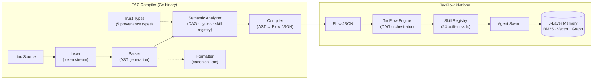

# 🧬 TAC — The TacFlow Agentic Code

> *"TAC is not a language for writing code. It is a language for thinking like an agent."*

**TAC** is a domain-specific language (DSL) designed for **autonomous AI agents** within the TacFlow swarm ecosystem.
It models how agents perceive, reason, remember, and execute tasks — as a **directed acyclic graph (DAG)** of skill invocations.

---

## 🏗️ Architecture Diagrams

> *Both diagrams built by **TacFlow Architect** — an AI agent in the TacFlow swarm — using **Archify** within the TacFlow platform.*

| Diagram | Description |
|---------|-------------|
| [**Execution Pipeline**](docs/tac-lang-pipeline.html) | Full 3-stage pipeline: Parse → Compile → Execute & Learn. Shows .tac source through AST, semantic analysis, DAG validation, compilation to Flow JSON, runtime execution, memory logging, and LoRA training data generation. |
| [**Compiler Architecture**](docs/tac-architecture.html) | Modular compiler internals: 9 Go packages (lexer, parser, semantic, types, compiler, formatter, manifest), trust type system, and TacFlow platform integration (Flow Engine, Skill Registry, Agent Swarm, 3-Layer Memory). |

### Compiler Architecture (Mermaid)



> **[🔍 View Execution Pipeline diagram](docs/tac-lang-pipeline.html)** — full 3-stage pipeline (Parse → Compile → Execute & Learn).
> **[🔍 View Compiler Architecture diagram](docs/tac-architecture.html)** — modular internals with Dark/Light mode, zoom, and multiple views.

---

## 📦 Repository Structure

```
tac-language/
├── SPEC.md                     # Full language specification (English)
├── BENEFITS.md                 # 10 strategic benefits of using TAC
├── cmd/
│   ├── tac/main.go             # CLI: parse, compile, fmt, validate
│   └── tac-parser/main.go      # Standalone parser CLI
├── ast/ast.go                  # AST types (reusable across all packages)
├── lexer/lexer.go              # Tokenizer (6 comparison + channel operators)
├── parser/parser.go            # Modular parser (uses ast + lexer)
├── semantic/analyzer.go        # Semantic analyzer (DAG, cycles, skill registry)
├── types/types.go              # Trust type system (5 provenance types)
├── compiler/compiler.go        # AST → Flow JSON compiler
├── formatter/formatter.go      # Canonical .tac formatter (round-trip)
├── manifest/manifest.go        # Flow manifest generator
├── examples/
│   ├── web_qa.tac              # Web Q&A flow (parallel search + synthesis)
│   ├── graph_builder.tac       # Knowledge graph builder from web pages
│   └── multi_agent_review.tac  # Multi-agent code review orchestrator
├── testdata/                   # Golden file tests
├── docs/
│   ├── tac-lang-pipeline.html   # 3-stage pipeline diagram (Archify)
│   └── tac-architecture.html   # Compiler architecture diagram (Archify)
├── tac_test.go                 # Test suite (17 tests + fuzz)
├── LICENSE                     # MIT License
├── README.md                   # This file
└── .gitignore
```

---

## 🚀 Quick Start

### 1. Clone

```bash
git clone https://github.com/TacFlow/tac-language.git
cd tac-language
```

### 2. Build

```bash
go build -o tac ./cmd/tac
```

### 3. Parse a `.tac` File

```bash
# Output AST to stdout
./tac parse examples/web_qa.tac

# Compile to Flow JSON
./tac compile examples/web_qa.tac

# Format (canonical style)
./tac fmt examples/web_qa.tac

# Validate (semantic analysis)
./tac validate examples/web_qa.tac
```

### 4. Inspect the AST

```bash
./tac parse examples/web_qa.tac | python3 -c "
import json, sys
ast = json.load(sys.stdin)
for n in ast.get('nodes', []):
    if n['type'] == 'Flow':
        print(f'Flow: {n[\"value\"]}')
        print(f'  Nodes: {len(n.get(\"nodes\",[]))}')
        print(f'  Edges: {len(n.get(\"edges\",[]))}')
        print(f'  Children: {len(n.get(\"children\",[]))}')
"
```

---

## 📖 Language Overview

### Core Concepts

| Concept | Description |
|---------|-------------|
| **Memories are Variables** | Every named value is persistent by default — no `let x = 42` |
| **Skills are the Standard Library** | No functions, only `skill` — maps 1:1 to real TacFlow APIs |
| **Execution is a DAG** | No call stack — every program is a directed acyclic graph |
| **Concurrency is Swarm Delegation** | No threads — delegate to peer agents in the swarm |
| **Context is Scope** | No nested `{}` — context windows model the attention span |
| **Hybrid Memory** | BM25 + Vector + Graph — queried simultaneously |

### Memory Architecture (3 Layers)

| Layer | Type | Strength | Weight |
|-------|------|----------|:------:|
| BM25 | Sparse (keywords) | Exact matching | 30% |
| Vector | Dense (768d embeddings) | Semantic similarity | 40% |
| Graph | Relational (SQLite + edges) | Indirect connections | 30% |

### Trust Types

| Type | Origin | Behavior |
|------|--------|----------|
| `Secret` | Credentials | Never echoed or logged |
| `Untrusted` | User input | Must be validated |
| `Fact` | Verified memory | High confidence |
| `Hallucinable` | LLM output | Must be fact-checked |
| `Control` | Runtime state | Read-only |

### Example: Web Q&A Flow

```tac
flow "Web Q&A" {
  input question: Untrusted

  node "search_web"    -> skill web_search(query: question, count: 3)
  node "search_memory" -> skill memory_search(query: question, scope: "shared")
  node "search_graph"  -> skill graph_search(query: question, depth: 2)
  node "synthesize"    -> skill llm.chat(prompt: "Answer using:", context: [..])
  node "verify"        -> skill verify(source: synthesize.result)
  node "speak"         -> skill tts.speak(text: synthesize.result)

  search_web -> synthesize
  search_memory -> synthesize
  search_graph -> synthesize
  synthesize -> verify -> speak

  on "user_message" -> search_web
}
```

---

## 🔧 Commands

```bash
tac parse <input.tac>        # Parse and print AST as JSON
tac compile <input.tac>      # Parse, validate, and output Flow JSON
tac fmt <input.tac>          # Format .tac source (canonical style)
tac validate <input.tac>     # Parse and run semantic analysis
tac version                  # Print version
tac help                     # Show help
```

---

## 📚 Examples

| File | Description |
|------|-------------|
| [`examples/web_qa.tac`](examples/web_qa.tac) | Parallel search (web + memory + graph), synthesis, fact-check, speak |
| [`examples/graph_builder.tac`](examples/graph_builder.tac) | Extract concepts from a URL, build knowledge graph with relationships |
| [`examples/multi_agent_review.tac`](examples/multi_agent_review.tac) | Spawn 3 reviewer agents in parallel, consolidate results |

---

## 📄 Specification

The full language specification is available in [`SPEC.md`](SPEC.md) (English, 13 sections):

1. Introduction
2. Core Philosophy
3. Hybrid Memory Architecture
4. Language Syntax
5. Types System — Trust Types
6. Flows — The Execution Model
7. Skills — The Standard Library
8. Swarm Concurrency
9. Context Window Management
10. Execution Pipeline
11. Training Data Format (LoRA / QLoRA)
12. Parser Implementation Guide
13. Appendix: Complete Examples

---

## 💡 Benefits

See [`BENEFITS.md`](BENEFITS.md) for the full analysis of the 10 strategic benefits of adopting TAC:

1. **Unified DSL** — One language for all agents
2. **Total Auditability** — Traceable from source to execution
3. **Auto-Generated Training Data** — Every run feeds LoRA/QLoRA fine-tuning
4. **Cross-Swarm Portability** — Language-agnostic AST
5. **Compile-Time Safety** — Trust Types prevent data leaks
6. **DAG Optimization** — Automatic parallelism, branch pruning
7. **3-Layer Memory** — BM25 + Vector + Graph fusion
8. **Skill Marketplace** — Versioned, shareable skill packages
9. **Pre-Execution Simulation** — Cost estimation before execution
10. **Competitive Moat** — Unique differentiator vs all competitors

---

## 🧪 Test Suite

```bash
# Run all tests (17 tests + fuzz harness)
go test ./...

# Run fuzz testing (5 seconds)
go test -fuzz=FuzzParser -fuzztime=5s .
```

---

## 📜 License

MIT License — see [`LICENSE`](LICENSE).

Copyright (c) 2026 Tacflow

---

## 🏆 About TacFlow

**TAC** is part of the **TacFlow** platform — an ecosystem of autonomous AI agents operating in swarms, sharing memory, skills, and reputation.
Learn more at [tacflow.ai](https://tacflow.ai).

---

*"A language is not a tool. It is a way of thinking."*
